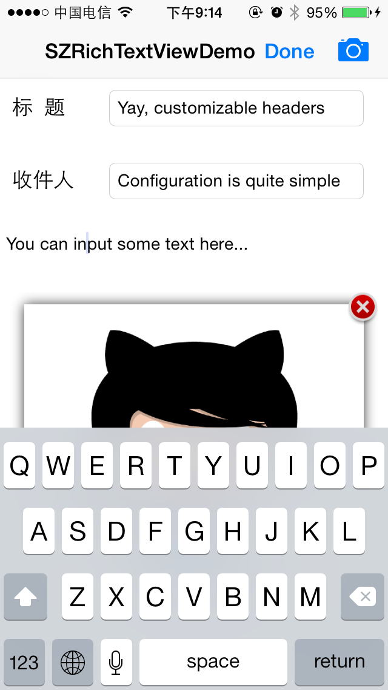
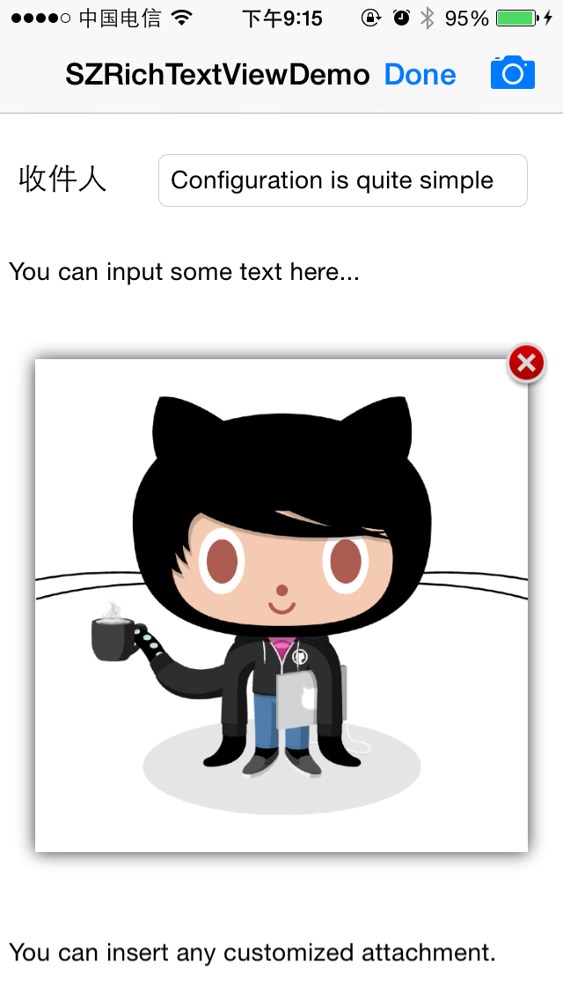
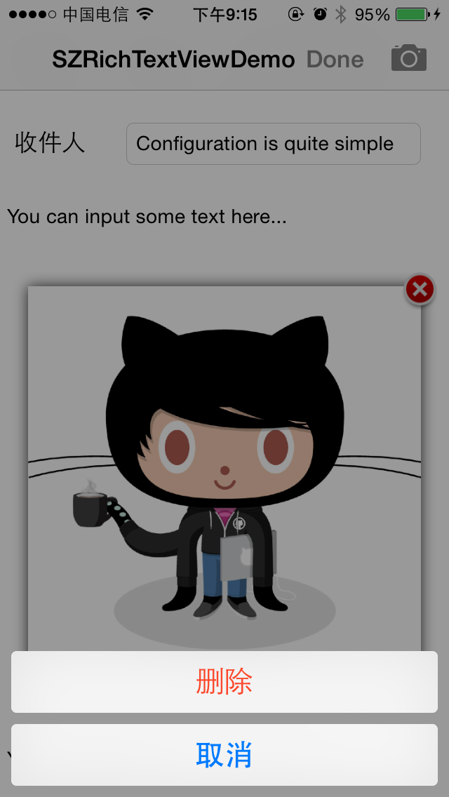

SZRichTextView
==============

SZRichTextView is yet another implementation of rich text editor on iOS, aiming to be light-weight, fast and convenient.

###Existing Implementations

Other rich text editor on iOS are mainly implemented in 2 ways:

####CoreText

CoreText is good, but in order to implement a rich text editor, much work needs to be done. For example, the "maginifying glass" effect.

A not-well-implemented CoreText rich text editor can be slow and buggy, while a well-implemented one can be much too complicated to be customized.

####HTML

HTML is also a good way to implement a rich text editor on iOS，for example, the rich text editor of Evernote.

But anything related to UIWebView will be full of hacks, which is hard to maintain, especially during major iOS upgrades.

###Why SZRichTextView?

In fact, SZRichTextView is 'not' a dedicated rich text editor, but it mimics a rich text editor, which, in my case, solves my problem perfectly.

Below images illustrates what SZRichTextView can do.

######Header fields can be easily added to SZRichTextView 

######SZRichTextView layouts segments of text along with images or customized attachments.

######Attachments can be deleted.

###Under the hood

SZRichTextView uses PSTCollectionView internally for better customization.

UICollectionView 'may' be used instead.(NOT TESTED)

###Credits

SZRichTextView is brought to you by Zongxuan Su and contributors to the project. If you have feature suggestions or bug reports, feel free to help out by sending pull requests or by creating new issues. If you're using SZRichTextView in your project, attribution would be nice.

Big thanks to [@steipete](http://petersteinberger.com/) for his great job in [PSTCollectionView](https://github.com/steipete/PSTCollectionView)  which really helped for this project.